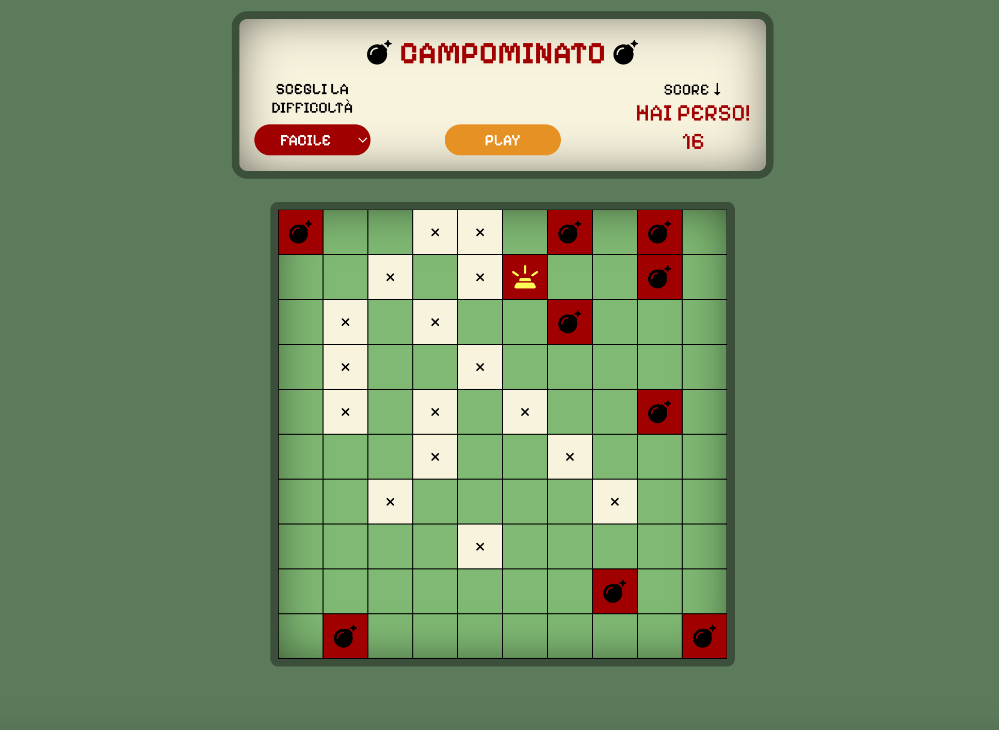

# Campo Minato

Questa è versione semplificata del gioco Campo Minato implementato utilizzando HTML, CSS e JavaScript. Il gioco offre tre diversi livelli di difficoltà: facile, intermedio e difficile. La dimensione della griglia varia in base al livello selezionato. Vinci se riesci a cliccare su ogni casella senza prendere le bombe. 

## Livelli di difficoltà

- Facile: Una griglia di 10x10 celle.
- Intermedio: Una griglia di 9x9 celle.
- Difficile: Una griglia di 7x7 celle.

## Tecnologie utilizzate

- HTML
- CSS
- JavaScript

## Struttura del codice

Il codice è suddiviso in diverse sezioni:

- HTML: Contiene la struttura della pagina web, inclusi i pulsanti di gioco e la griglia.
- CSS: Gestisce lo stile e il layout della pagina.
- JavaScript: Implementa la logica di gioco, inclusi i diversi livelli di difficoltà e la gestione degli eventi dei pulsanti e del numero delle celle della griglia a seconda della difficoltà.

## Future implementazioni

- Timer: un conto alla rovescia, allo scadere del quale il gioco termina

